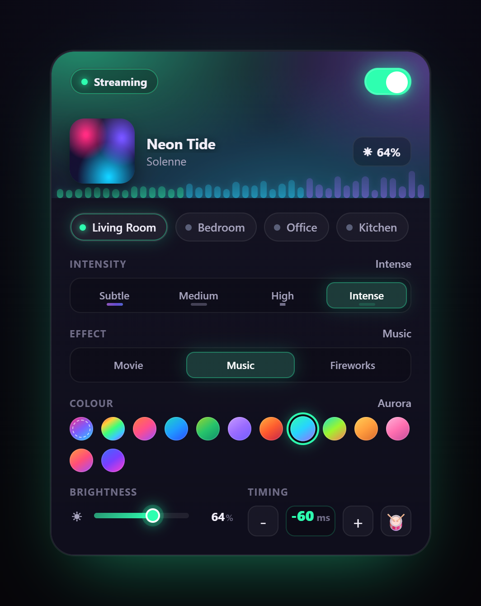

# Hue Synco for Home Assistant

[](https://github.com/hacs/integration)
[](LICENSE)


Real-time music-reactive lighting for **Philips Hue Entertainment areas**, driven by **any Home Assistant media player — Music Assistant players first and foremost**. Beat detection, frequency analysis and spatial choreography stream straight to the bridge over the Hue Entertainment API (DTLS-encrypted, up to 50 Hz), and a bundled dashboard card mirrors the whole show live — no separate frontend install.

<p align="center">
  
</p>

---

## Contents

- [What it does](#what-it-does)
- [Player support](#player-support)
- [Features](#features)
- [The dashboard card](#the-dashboard-card)
- [Requirements](#requirements)
- [Installation](#installation)
- [Setup](#setup)
- [Controls](#controls)
- [Services](#services)
- [Options](#options)
- [Experimental / legacy audio sources](#experimental--legacy-audio-sources)
- [How the pipeline works](#how-the-pipeline-works)
- [⚠️ Photosensitivity warning](#️-photosensitivity-warning)
- [Security notes](#security-notes)
- [Troubleshooting](#troubleshooting)
- [Known limitations](#known-limitations)
- [Development](#development)

---

## What it does

Hue Synco follows whatever is playing on your chosen media player and translates the audio into a synchronized light show across a Hue entertainment area.

Every track is analysed once in the background — beats are located precisely, downbeats and section boundaries are found (verse, chorus, build, drop). During playback those events are **scheduled** ahead of time, so the choreography lands exactly on the beat rather than chasing it. A continuous spectral layer (a 16-band melbank spread spatially across the room) keeps every lamp alive between beats.

What reacts matters as much as when: reactions are **proportional to the sound's real loudness** (a quiet pluck gives a small dim pulse, the drop slams the room) and are keyed to **instruments, not vocals** — sung melodies and sustained tones are filtered out of the beat streams so the lights follow the music, not the singing.

You choose which player drives the lights — pick any player right from the card, or let the integration auto-follow whatever is playing (Music Assistant players preferred).

## Player support

**Any Music Assistant player works out of the box.** The integration picks the best audio strategy automatically and upgrades live when a better one becomes available:

| Player type | Audio source |
|---|---|
| **Sendspin** | Position-locked decoding of the track's stream — real live audio, full beat accuracy |
| **Squeezelite / Slimproto** | Position-locked stream decoding (re-syncs on drift) |
| **AirPlay, Chromecast, Sonos, DLNA, ESPHome, groups** | Pre-analysed track map — full beat accuracy with no live stream needed |
| **Any player at all** | Metadata fallback — gentle animation, upgraded to a real source automatically the moment one becomes tappable |
| Snapcast-backed players *(experimental/legacy)* | Real-time stream tap with automatic buffer alignment — see [legacy sources](#experimental--legacy-audio-sources) |

The followed player can be **pinned per area** (from the card's player dropdown or the `set_options` service) or left on auto.

## Features

### Audio analysis
- **Full-track beat tracking** — a dynamic-programming beat tracker runs offline, so beats are pre-located, not guessed in real time
- **SuperFlux onset detection** — spectral flux on log-compressed magnitudes with vibrato immunity; separate bass/kick, mid/guitar and broadband streams avoid hi-hat false positives
- **Salience-proportional reactions** — every flash, wave and scheduled pulse scales with the sound's *absolute* loudness relative to the track; tiny sounds can never flash at full brightness, and a locked beat grid stops slamming through breakdowns
- **Vocal rejection** — onsets are classified by how broadband their spectral flux is: drums splash across the spectrum, sung vowels stay narrow and are muted (with a soft knee, per intensity mode)
- **5-band frequency decomposition** with per-band automatic gain control
- **16-bin melbank** — a continuous, exponentially-smoothed spectrum spread left-to-right across the room
- **Song structure detection** — builds, drops, verses and choruses are identified; brightness swells on drops, desaturates during builds, breathes during breakdowns
- **Library pre-analysis** — a background sweep analyses your whole library ahead of time (resumable, survives restarts, one track at a time, always yielding to live playback) with a progress sensor and failure reporting

### Choreography
- **6 intensity modes** (Auto → Subtle → Medium → High → Intense → Extreme) sharing one unified renderer; the mode also sets how *picky* beat selection is — the mode **is** the sensitivity
- **Auto intensity** — reads the music's live intensity (loudness, the size of the moment, tempo and how busy the beat is) and picks a rung for you, climbing on a drop and easing back in the quiet parts. A checklist on the card sets **which** rungs it may choose from, and the music is spread across *exactly that range*: the lowest enabled rung is the floor for the quiet parts, the highest is reached on the biggest moments — so add Intense/Extreme and they get used, or make High the lowest and it becomes the floor. Switches are slow and unhurried (long dwell, wide hysteresis) so a rung always has time to breathe
- **Instrument role assignment** — lights are split into bass, guitar and vocal roles, spread evenly around the room and re-dealt every few bars; scales cleanly from 1 to 10 lights
- **3D spatial waves** — beat wavefronts sweep the room using the actual lamp positions from the entertainment area; lows to one side, highs to the other, treble to the higher lamps
- **Beat highlight selection** — brightness pops only on beats that stand out against the recent 24-beat window

### Colour
- **Album art extraction** — dominant colours pulled from cover art in perceptual CIELAB space; muted artwork stays muted; re-extracted on every track change
- **Song harmony colouring** — a palette derived from the track's pitch content, shifting with each section
- **12 preset themes** — Sunset, Ocean, Forest, Lavender, Ember, Aurora, Rainbow, Tropical, Savanna, Blossom, Honolulu, Galaxy

### Effects
- **Music** — full beat/frequency choreography (default)
- **Movies** — calm and non-distracting; brightness follows soundtrack energy with warm cinematic drift, no flashing
- **Fireworks** — bursts ignite on big beats with a rapid fade-out

## The dashboard card

The **Hue Synco Card** ships inside the integration and registers itself as a dashboard resource automatically — no HACS frontend entry, no manual resource URL, no build step. Search for *"Hue Synco Card"* in the card picker. Updates are picked up automatically (the resource URL carries a content hash, so you never need to hard-refresh).

### The hero
An immersive now-playing header themed by the music itself — the blurred album art bleeds into the backdrop and the extracted album colours drive every accent:

- **Audio-source pill** — what is actually driving the lights right now: `Live audio`, `Live (snapcast)`, `Track map`, or `Metadata only` (amber warning), so a dead tap is obvious at a glance
- **Power toggle**, **album art with beat gloss**, **marquee title/artist**, **live brightness readout**, and large centred **transport controls** that drive the followed player directly
- **Song-structure timeline** — the track's energy silhouette with section boundaries and a moving playhead; the next section pulses as a drop approaches

### The body
- **Visualizer bars** — a real ~20 Hz feed of the analysis output, delayed through the same timing buffer as the lights; it renders exactly what the room is reacting to
- **Room mirror** — every lamp at its real position, glowing in the exact colour being streamed to it, with rings marking its instrument role
- **Area & Player dropdowns** — side-by-side titled selectors: one card controls several areas, and the lights can be pinned to any player (or Auto); menus open as floating popovers that scroll when the list is long
- **Intensity selector** with live micro-animation previews, **colour palette dots**, **brightness slider** and a **timing-offset stepper** (±ms fine trim) with an **Auto** toggle that calibrates the per-song startup delay for you (locks a value early in each track; falls back to the manual trim when off)
- **Beat Pads** — a full-page overlay of three tall Low / Mid / High tap columns, each driving a third of the room; while open, the automatic beats pause so *your* taps flash the lights; auto-releases when closed

### Behaviour
- **Idle beauty** — while paused, the card (and the room) drifts slowly through the palette instead of freezing
- Respects `prefers-reduced-motion`; pauses all animation when scrolled off-screen (wall tablets keep dashboards open 24/7)
- **Demo mode** — added with no config, the card renders a self-running demo so you can style your dashboard before wiring entities

### Tablet layout
A landscape-optimised sibling — the **Hue Synco Card (Tablet)** — ships alongside the mobile card in the same soft Hue-navy theme, purpose-built for wall tablets and dashboards viewed sideways. Search for *"Hue Synco Card (Tablet)"* in the card picker. It shares all of the mobile card's real-data wiring (live analysis feed, album-colour extraction, player picker, beat pads) in a two-column arrangement:

- **Left column** — a large centred album cover with a beat-reactive halo, marquee title/artist, centred transport, a **waveform scrubber** with time readout, and a **live frequency map** (one glowing dot per lamp, laid out low → high across the room)
- **Right column** — the Area & Player dropdowns, an **intensity picker** with a live per-mode equalizer, the Effect segmented control, colour palette dots, and the brightness slider + timing stepper (with the Beat Pads button)

### Card configuration

The card picker pre-fills a working template. Full form:

```yaml
type: custom:hue-music-sync-card
areas:
  - name: Living Room
    switch: switch.music_sync_living_room
    intensity: select.music_sync_living_room_intensity
    effect: select.music_sync_living_room_effect
    colour: select.music_sync_living_room_colour
    brightness: number.music_sync_living_room_brightness
    timing: number.music_sync_living_room_timing_offset
    media_player: media_player.living_room   # optional; the picker can change it live
  # ...more areas
```

A single flat area (`switch:`, `intensity:`, … at the top level) also works. Every key is optional — the card renders whatever you give it and falls back to demo mode with none.

The tablet card takes the **same** configuration — just change the type:

```yaml
type: custom:hue-music-sync-card-tablet
areas:
  - name: Living Room
    switch: switch.music_sync_living_room
    # ...same keys as above
```

## Requirements

- **Home Assistant** 2024.12 or newer
- **Music Assistant** integration installed and connected (recommended; any HA media player works with reduced accuracy)
- **Philips Hue Bridge v2** (the square one — v1 does not support Entertainment streaming)
- **Entertainment area** created and arranged in the Hue app (Hue Synco drives existing areas, it does not create them)
- **ffmpeg** — included with HAOS, Container and Supervised installs

## Installation

### HACS (custom repository)
1. In HACS, open **⋮ → Custom repositories**
2. Add `https://github.com/engabd11/syncoV2` with type **Integration**
3. Install **Hue Synco** and restart Home Assistant

### Manual
1. Copy the `custom_components/hue_music_sync` folder into your `config/custom_components/` directory
2. Restart Home Assistant

## Setup

1. Go to **Settings → Devices & Services → Add Integration** and search for **Hue Synco**
2. Enter your Hue bridge IP address
3. Press the **link button** on the bridge when prompted — the bridge's TLS certificate is pinned at this moment (see [Security notes](#security-notes))
4. Select which entertainment areas to enable
5. Add the **Hue Synco Card** to a dashboard (it's already in the card picker)

> Create and arrange your entertainment areas in the **Hue app** first — the lamp positions you set there are what the spatial choreography and the card's room mirror use.

## Controls

Each entertainment area gets:

| Entity | Type | Description |
|---|---|---|
| Sync | Switch | Starts and stops the light show for this area |
| Intensity | Select | Choreography intensity (see below) |
| Effect | Select | Rendering style (Music, Movies, Fireworks) |
| Colour | Select | Colour palette source |
| Brightness | Number | Master brightness ceiling (5–100%) |
| Timing offset | Number | Manual sync trim in milliseconds (−500 to +500) |

Plus, once per installation:

| Entity | Type | Description |
|---|---|---|
| Analyse library | Button | Kicks off the background library pre-analysis |
| Library analysis | Sensor | Live progress, with failure details in its attributes |

While an area is syncing, its switch also exposes now-playing, album-colour, tempo and audio-source attributes — the state the card runs on, available to your own automations too.

### Intensity modes

| Mode | Flash limiter | Character |
|---|---|---|
| **Auto** | Strict | Follows the song's tempo and picks Subtle/Medium/High for you |
| **Subtle** | Strict | Gentle spatial gradient, soft colour drift, small beat steps |
| **Medium** | Strict | Visible dimming, soft flashes on stronger beats, wide colour spread |
| **High** | Strict | Per-instrument spatial split (bass/guitar/vocal), dynamically assigned to the instruments actually playing |
| **Intense** | Relaxed | Unified club with a fast but smooth dim↔bright swing on the beat, colour shifting each hit; keeps a soft glow in the gaps |
| **Extreme** | Relaxed | Same quick swing but a **true dark room** (floor 0) — quiet parts go black, every beat brightens the room out of the dark |

See the [photosensitivity warning](#️-photosensitivity-warning) for what *Strict* and *Relaxed* mean.

## Services

| Service | Description |
|---|---|
| `hue_music_sync.activate` | Start sync for one or more areas; optionally set mode, effect, colour, brightness and the followed player |
| `hue_music_sync.deactivate` | Stop sync |
| `hue_music_sync.set_options` | Change any setting live without restarting the session — including pinning or clearing the followed player |
| `hue_music_sync.prewarm_library` | Analyse your whole Music Assistant library in the background and cache it to disk, so **every** track reacts with full beat accuracy the first time it plays. `retry_failed: true` clears recorded failures (and ambient-only maps) so they analyse again |
| `hue_music_sync.analyze_track` | Diagnose **one** song right away and post the verdict as a notification: tier, tempo, confidence, and exactly why a beat grid was rejected. Takes a stream `url`, an `artist` + `title` library lookup, or a `media_player` that is currently playing |

Pre-analysing the library (or pressing the **Analyse library** button) is the way to make a brand-new track react instantly. It runs gently — one track at a time, yielding to live playback — and is resumable **and incremental**: re-running only analyses what's new, so it is also how newly added Navidrome/library tracks get picked up.

### Library analysis, failures and re-analysis

Every analysed track lands in one of three tiers:

- **Full** — a trustworthy beat grid was found: scheduled, anticipatory beat playback (the best show).
- **Ambient** — the audio decoded fine but no beat schedule was trustworthy (freely-timed, rubato, beatless material). The lights still get everything else: per-frame energy/spectrum, sections, song colours, and the *detected* onsets — the live beat tracker locks onto those in a few seconds. **A decodable track never falls back to the lifeless metadata animation.**
- **Failed** — the audio could not be fetched/decoded at all (URL, login, network). These are recorded persistently with the reason.

Where to look:

- The **Library analysis** sensor: `failed` / `newly_ambient` counts, a capped `failed_tracks` list (Artist - Title + reason), and `pending` (tracks enumerated but not yet analysed).
- The full uncapped report is written to `config/hue_music_sync/trackmaps/analysis_report.json` after each sweep.
- `hue_music_sync.analyze_track` re-analyses a single song on demand and explains its verdict (beats-on-peaks contrast, interval spread vs the local tempo, coverage, tempo stability).

The tempo analysis follows **drifting and changing tempo** (a live drummer, a 100→140 BPM switch) via a windowed tempogram with Viterbi tempo-path decoding, so dynamic, human-played music gets a full-tier grid instead of being rejected. After updating to a release that improves the analysis, run `prewarm_library` with `retry_failed: true` once so previously failed/ambient tracks get re-scored.

## Options

**Settings → Devices & Services → Hue Synco → Configure**:

| Option | Description |
|---|---|
| Enabled entertainment areas | Which areas get entities |
| Restore lights on stop | Snapshot and restore light state when sync stops |
| Snapcast server host | *(experimental/legacy)* real-time audio tap for Snapcast-backed players |
| OpenSubsonic URL / credentials | *(optional)* direct library-track streaming and analysis via Navidrome or any OpenSubsonic server |

## Experimental / legacy audio sources

Hue Synco began life around Snapcast/Squeezelite before focusing on Music Assistant players. These paths still work and are kept for setups that use them, but they are **not required** and receive less testing:

- **Snapcast tap** — when a Snapcast server host is configured *and* the followed MA player is Snapcast-backed, the live stream is tapped directly with automatic buffer alignment. The most latency-accurate source, but requires running snapserver yourself.
- **OpenSubsonic / Navidrome** — when Music Assistant exposes no tappable stream URL for a player (e.g. Sendspin with an OpenSubsonic provider), the integration can build the standard `/rest/stream` request itself from your library URL + login and decode that. Also used by the library pre-analysis.
  - Scheme-less URLs default to **https://**. If your server is plain HTTP on the LAN, write `http://` explicitly.

## How the pipeline works

```
Audio source ladder (per followed player, best available wins):
  Snapcast tap → MA/Sendspin stream decode → offline track map → metadata glow
        ↓
Real-time analysis (5-band FFT, 16-bin melbank, SuperFlux onsets, tempo,
absolute-loudness salience + onset broadbandness for event selection)
        ↓
Offline track map (beat grid, downbeats, section boundaries — analysed once,
then cached to disk so the same track reacts instantly next time)
        ↓
Album art → CIELAB colour palette extraction
        ↓
Effect engine (instrument roles, spatial waves, brightness envelopes, palette sampling)
        ↓
Eye-safety stage (flash limiter — strict or relaxed per mode, brightness floor,
red guard, gamut clamp, colour slew)
        ↓
HueStream encoder (RGB → xy chromaticity + brightness, Gamut C clamping)
        ↓
Pure-Python DTLS 1.2 (PSK mutual auth, AES-128-GCM) → Hue Bridge
```

The DTLS transport is implemented in pure Python — no external OpenSSL dependency — covering exactly what the bridge needs: PSK handshake with **enforced server verification**, AES-128-GCM record encryption, keepalives, and a graceful close so the bridge frees the session immediately when sync stops.

The card talks to the integration over Home Assistant's WebSocket API (`hue_music_sync/subscribe` for the ~20 Hz live feed, `/players` for the picker, `/tap` and `/drum` for the drum pad), so everything on it — bars, room mirror, timeline — reflects the actual session, not a simulation.

## ⚠️ Photosensitivity warning

Audio-reactive lighting can produce rapid whole-room brightness swings. Hue Synco applies an eye-safety limiter to **every** frame it emits — but at two different levels:

- **Strict (WCAG 2.3.1-compliant)** — Auto, Subtle, Medium, High and the Movies effect: a hard cap of 3 whole-room flashes per second, a minimum brightness floor that prevents pure-black strobing, a saturated-red guard, and per-frame colour slew limits.
- **Relaxed** — Intense and Extreme: a much higher flash budget that real music never reaches (the club character is untouched), which still hard-caps genuine strobe output. **This level is *not* WCAG-compliant. Intense and Extreme are unsuitable for anyone with photosensitivity.**

If anyone in the room may be photosensitive, stay on Auto/Subtle/Medium/High.

## Security notes

- **Bridge certificate pinning** — Hue bridges use a self-signed TLS certificate, so ordinary CA validation is impossible. Hue Synco captures the bridge's certificate at pairing time (trust-on-first-use) and verifies every later CLIP API call against it. If the bridge is factory-reset or replaced, remove and re-add the integration to re-pair and re-pin. Entries created by older versions pin automatically on their next reload.
- **DTLS mutual authentication** — the entertainment stream's handshake enforces the server's `Finished` message, so the integration will refuse to stream colours to a device that does not actually know the pre-shared key.
- **ffmpeg protocol whitelist** — every ffmpeg invocation is restricted to `http/https/tcp/tls`, so a malicious stream or artwork URL cannot steer the decoder into `file://` or other local protocols.
- **Log redaction** — stream and artwork URLs are logged with their query strings masked (Subsonic auth tokens ride in query strings). Debug logs are safe to paste into bug reports.
- Credentials (Hue app key, DTLS client key, optional Subsonic login) are stored in Home Assistant's config entry storage, like other HA integrations. Home Assistant does not encrypt that storage at rest.

## Troubleshooting

- **Card shows "Custom element doesn't exist"** — usually a stale cached app shell; reload the page once. The integration registers the card as a Lovelace resource automatically; if you removed that resource by hand, re-add `/hue_music_sync/hue-music-sync-card.js` under **Settings → Dashboards → Resources**, or reload the integration.
- **Lights react late/early** — use the card's timing-offset stepper (±ms) to land the flashes exactly on the audible beat in your room, or flip the timing **Auto** toggle to have the per-song startup delay calibrated automatically.
- **"Metadata only" pill stays amber** — no tappable stream and no track map yet. Run **Analyse library** once, or configure the OpenSubsonic options so tracks can be fetched for analysis.
- **First play of a new track reacts generically** — full offline analysis takes ~10 s on slower hardware; the show upgrades mid-song when it lands. `prewarm_library` removes this entirely.
- **Position-coarse players (e.g. Sonos)** — ~500 ms position granularity reduces track-map timing precision; the timing stepper helps.
- **Bridge unreachable after a factory reset** — the pinned certificate no longer matches (by design). Remove and re-add the integration.

## Known limitations

- **Hue Bridge v2 only** — the v1 (round) bridge does not support Entertainment streaming
- **One area streaming at a time per bridge** — a single DTLS channel per bridge; multiple bridges each get their own entry
- **Cache re-analysis after upgrades** — when an update changes the track-map format, previously analysed tracks re-analyse once in the background on their next play (or in one sweep via `prewarm_library`)

## Development

```
custom_components/hue_music_sync/
  audio/      sources (MA stream, track map, snapcast, metadata), analyzer, tempo, structure
  color/      album-art & song palettes
  effects/    engine, modes, spatial, fireworks, safety limiter
  hue/        CLIP v2 client, pure-Python DTLS 1.2, HueStream encoder
  frontend/   the bundled dashboard card (no build step)
tests/        pure DSP/colour/encoder unit tests (no HA install needed): pytest tests/
tests_ha/     config-flow tests on the HA harness (run in CI)
scripts/      developer spikes & analysis tools — not part of the integration
```

Run the unit tests with `pip install pytest numpy aiohttp cryptography` then `pytest tests/`.

## License & credits

MIT — see [LICENSE](LICENSE).

Not affiliated with, endorsed by, or sponsored by Signify (Philips Hue) or the Music Assistant project. *Hue* is a trademark of Signify Holding B.V.
